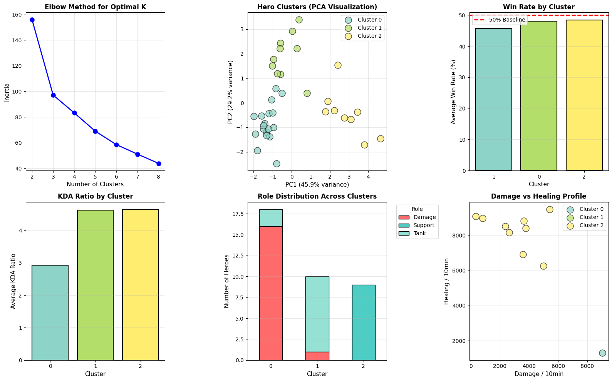

# Unsupervised-Learning
**Code being revised. Documentation ongoing**

## Output


```
Dataset shape: (37, 133)

Heroes analyzed: 37

Heroes by Role:
Role
Damage     17
Tank       11
Support     9
Name: count, dtype: int64

============================================================
CLUSTERING RESULTS
============================================================

CLUSTER 0 (18 heroes)
Heroes: Genji, Cassidy, Hanzo, Reinhardt, Widowmaker, Soldier: 76, Tracer, Junkrat, Ashe, Reaper, Pharah, Doomfist, Mei, Bastion, Symmetra, Torbjorn, Sojourn, Echo

Average Stats:
  • Win Rate: 48.1%
  • KDA Ratio: 2.92
  • Eliminations/10min: 18.1
  • Damage/10min: 8186
  • Healing/10min: 1299
  • Deaths/10min: 7.9
  • Role Distribution: {'Damage': np.int64(16), 'Tank': np.int64(2)}

CLUSTER 1 (10 heroes)
Heroes: D.Va, Zarya, Roadhog, Sigma, Orisa, Winston, Sombra, Wrecking Ball, Ramattra, Junker Queen

Average Stats:
  • Win Rate: 45.7%
  • KDA Ratio: 4.62
  • Eliminations/10min: 18.7
  • Damage/10min: 8642
  • Healing/10min: nan
  • Deaths/10min: 6.2
  • Role Distribution: {'Tank': np.int64(9), 'Damage': np.int64(1)}

CLUSTER 2 (9 heroes)
Heroes: Ana, Mercy, Kiriko, Moira, Zenyatta, Lucio, Baptiste, Brigitte, Lifeweaver

Average Stats:
  • Win Rate: 48.4%
  • KDA Ratio: 4.64
  • Eliminations/10min: 10.1
  • Damage/10min: 3065
  • Healing/10min: 8300
  • Deaths/10min: 6.4
  • Role Distribution: {'Support': np.int64(9)}
```